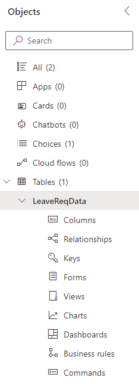
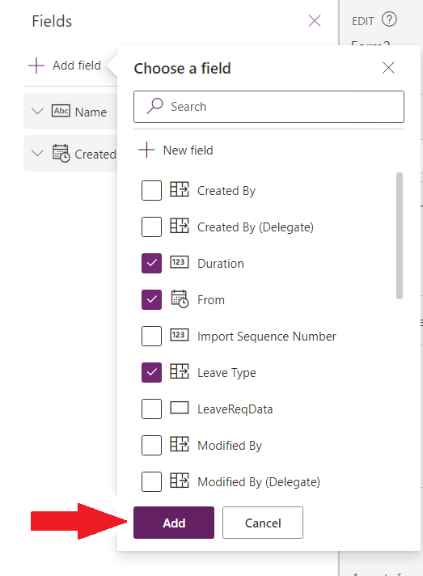
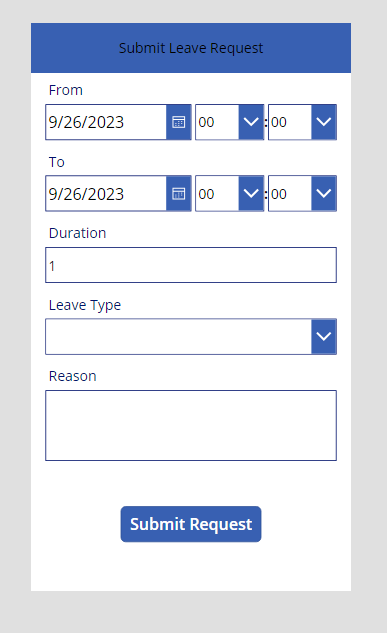
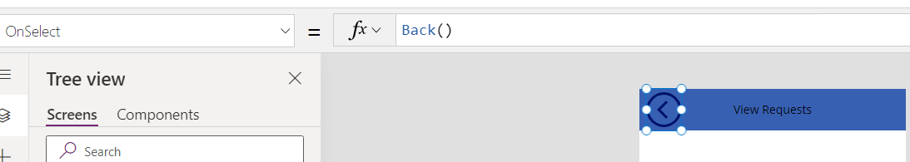
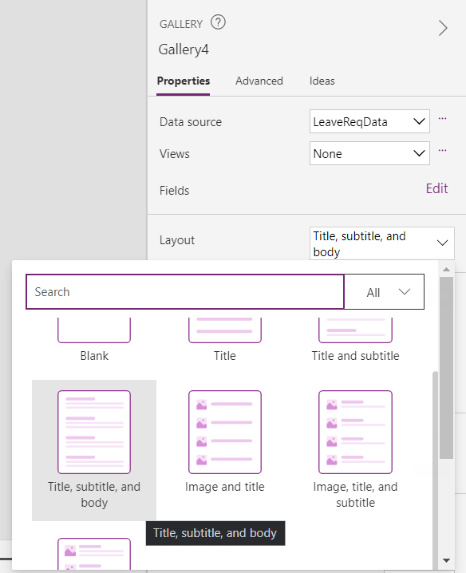

# Scenario
At "NexaTech Innovations", the HR manager, Mrs. Smith, was overwhelmed with the increasing number of leave requests from employees. Papers were piling up on her desk, emails were getting lost, and she was struggling to keep track. 

One day, she approached you with an idea: "What if we had an app on employees' phones, linked to their work accounts, where they could send their leave requests directly ? they could review them within the app and check their leave dates".

# Functional Requirements 
**Mobile Integration & Work Account Link:** The app should be accessible on employees' phones and be directly linked to their official work accounts. This ensures that only authorized employees can send leave requests.

**Leave Request Submission:** Employees should be able to submit leave requests by selecting the type of leave (e.g., sick leave, vacation), specifying the start and end dates, and adding any additional notes if needed.

## In this Lab you will learn:

- Create a table in Dataverse
- Create a Canvas app 
- Editing canvas app template(Optional Lab)


 **Notes: Sign in to Dataverse using the email and password provided to you.**
 
 **Notes: It is recommended to work on your browser in private or incognito mode**


# Task 1: Create a table in Dataverse

### Step 1: Sign in to Power Platform
 

1.  Open a web browser and navigate to https://admin.powerplatform.microsoft.com/environments

2.  Sign in using the Microsoft account provided to use
    for this training

3.  Once signed in, click on \"Environments\" in the left navigation menu.

### Step 2: Setup a new environment

1. From the left navigation panel, click on *`Environments`*

2. From the top toolbar, select *`+ New`*


3. Fill in the fields as follow:
   - **Name**: `DevEnv1`
   - **Region**: `Europe - Default`
   - **Type**: `Developer`


4. Click *`Next`*
5. Set the **Currency** to `USD ($)`
6. Click *`Save`*

7. In the list of environments, your **DevEnv1** environment should now
show as **Preparing**.


Your practice environment will take a few minutes to provision.
Refresh the **Environments** list if needed.

8. When your environment shows as **Ready**, you are good to go!
   
### Step 3: Create solution

0. Navigate to the https://make.powerapps.com/ portal page.

1. Make sure you are in the environment you just created.(near the bell icon)


2. From the left navigation panel, select *`solution`* and then select *`+ New
solution`*.

3. For **Display name**, enter `Leave Request App Solution`

4. Select *` New publisher`*, under the **Publisher** field.

5. Fill in the fields as follow: (Make sure you do not add spaces)
   - **Display Name**: `(Enter your name)` ex: 'JohnDoe'
   - **Name**: `(Enter your name again)` ex: 'JohnDoe' 
   - **Prefix**: `dev`


6. Click on *`Save`*

7. Click to select the Publisher you just created from the dropdown menu


   
8. Select **Create**.

### Step 4: Create a Table 


1. Once inside your solution, select *`+ New`* \> *`Table`* \> *`Table`*.


2. Fill in the field as follow:
   - **Display Name**: `LeaveReqData`

3. Click *`Save`*

### Step 5: Add Columns to the Table

1. Once in the Table, from the top banner, click *`+ New`* > *`Column`*


3. Fill in the fields as follow:
   - **Display Name**: `Notes`
   - **Data Type**: ` Text > Multiple line of
text > Plain Text`


4. Click *`Save`*

5. Again, Click *`+ New`* > *`Column`* to add a new column.

6. Fill in the fields as follow:
   - **Display Name**: `Reason`
   - **Data Type**: ` Multiple line of
text`

7. Click *`Save`*


8. Click *`+ New`* > *`Column`*

9. 3. Fill in the fields as follow:
   - **Display Name**: `Duration`
   - **Data Type**: ` Number > Whole Number`

10. Click *`Save`*


11. Click *`+ New`* > *`Column`*

12. Fill in the fields as follow:
   - **Display Name**: `Leave Type`
   - **Data Type**: ` Choice `
   - **Sync this choice with**: (Click on the *`+ New choice`* button)

13. Fill in the new fields as follow:
   - **Display Name**: `LeaveTypeChoices`
   - **Label**: ` Sick Leave `

14. Click on *`+ New choice`* to add a new label for each of the following values:
    - `Maternity Leave`
    - `Vacation`
    - `Bereavement Leave`

15. Your Choice should look like this: 


16. Click *`Save`*

17. Select the empty **Sync this choice with** field dropdown, and choose the `LeaveTypeChoices` created

18. Your column should look like this: hit save


19. Click *`+ New`* > *`Column`*

20. Fill in the fields as follow:
   - **Display Name**: `From`
   - **Data Type**: ` Date and time`
   - **Data Format**: ` Date only `


21. Click *`Save`*

22. Fill in the fields as follow:
   - **Display Name**: `To`
   - **Data Type**: ` Date and time`
   - **Data Format**: ` Date only `


23. Click *`Save`*

24. Look at the **Objects** panel, your solution should look like this:
  


25. Click on *`All`* 

26. Select *`Publish all customizations`* from the command bar and wait
for the publishing to complete

# Task 2: Create a Canvas app

### Step 1: Create your first app

1. Navigate to the "https://make.powerapps.com/" portal page and make
sure you're in the `DevEnv1` environment

2. Select *`Solutions`* from the left panel and open the *`Leave Request App Solution`* solution.

3. Select *`+ New`* \> *`App`* \> *`canvas app`*.

4. Enter **LeaveReq App**, select *`Phone`* for format, and
click *`Create`*.


5. Click *`Skip`*.
6. You are now in the PowerApps Studio, where we will start creating our application
7. From the tool bar, select *`+ Insert `* > *` rectangle `*
8. Set the rectangle's properties on the right as the following image


9. From the tool bar, select *`+ Insert `* > *` Text Label`* 


10. Move the label to the top of the rectangle and in the *`Properties`* panel select `Align Center` to create our application header


11. Change the "Text" property of the text label to `Leave Req App`

12. Select **+ Insert** from the top panel, choose **Media** and select **Image**.


13. Select the **Image** you added, select the image property and enter the following code in the function bar.

``` 
User().Image
```

14. Your page should now look like the image below. Click **Save** to
save it.


 ### Step 3: User function in Power Apps


1. Select the **+ Insert** from the left navigation to add a **Text
 label**

2. Copy the below code in the "Text" property of the text label:

``` 
"Welcome " & User().FullName
``` 


3. Select **+ Insert** and add a *`Button`*
4. Change the text property of this button to `Submit Request`
5. Change the `OnSelect` property to:
   ```
   Navigate(Screen2)
   ```


You will notice PowerApps is telling you there is an error in this formula. **Don't worry!**, We will fix that in the next step when we create `Screen2`

 ### Step 4: Creating Your Submit Request Screen

1. From the tree view, click on `+ New Screen`, Select `Blank Screen` from **Layout**


2. Copy the two *`Rectangle1`* and *`Label2`* Components of the `Screen1` and paste them in the `Screen2` to have a header for the second page.


3. Change the `Text` property of *`Label2_1`* to `Submit Leave Request`

4. Select *`+ Insert`* from the left navigation to add an **Edit Form** control to your screen


5. Reposition the form to be under the rectangle 

6. After adding the form, make sure it is selected, then on the **Properties** panel click on the *`Data Source`* dropdown and search for `Leave` 


7. Select the *`LeaveReqData`* Microsoft Dataverse table

8. Again on the **Properties** panel, select *`Edit Fields`* > *`Add new field`*


9. In the **Choose a field** window, select the following fields in order:
    - *`From`*
    - *`To`*
    - *`Duration`*
    - *`Leave Type`*
    - *`Reason`*

10. Click on *`Add`*



11. In the **fields** panel, click on the ellipses (...) of the `Created on` column, and select *`Remove`*


12. Expand the form on the canva to display all the added columns


13. From the tree view, expand `Name_DataCard3` and select the *`DataCardValue`* field inside it

```
Please note that the naming of the components may differ specially the numbers after each name because power apps automatically increments the number after each creation of a component even if a previous one was deleted; you might find minor difference in the labs and the actual work that you are doing; we trust that you will be able to point out which component we are currently working with. If you have trouble doing so, don't hesistate to ask your instructor
```

14. In the **Properties** panel, select the *`Advanced`* tab, and click on the lock to unlock the component


15. After unlocking the component, go back to the **Properties tab**, select the *`Default`* property
16. In the **Formula** bar, type in the following function:
    
    ```
    User().FullName
    ```

17. From the tree view, select the `Name_DataCard`
18. In the **Properties** panel, toggle off the `Visible` property


After that, your canva app should look like this:


19. From the tree view, expand `Duration_DataCard` and select the *`DataCardValue`* field inside it
20. In the **Properties** panel, select the *`Advanced`* tab, and click on the lock to unlock the component
21. After unlocking the component, go back to the **Properties tab**, select the *`Default`* property
22. In the **Formula** bar, type in the following function:
    
    ```
    RoundDown(DateDiff(DateValue1.SelectedDate,DateValue2.SelectedDate) / 7, 0) * 5 + Mod(5 +Weekday(DateValue2.SelectedDate) - 
    Weekday(DateValue1.SelectedDate),5)+1
    ```
  **Important!**
  
  *Make sure the values `DateValue1` and `DateValue2` in the formula refer respectively to the dates value field of the `From` and `To` column in the form, you might need to change the number `1` and `2` based on your tree view to make the formula work. similar to the below picture*


23. Select **+ Insert** and add a *`Button`*
24. Reposition the button under the form
25. Change the text property of this button to `Submit Request`
26. Inside the `OnSelect` property, paste in the below formula:
    
``` 
SubmitForm(Form1);ResetForm(Form1);
```

Your canvas should look like this:



27. Press *`F5`* button on your keyboard, or the *`Play`* **icon** to preview the app

 

Note: You will notice that the form will not load, but will show the message `No item to display` instead. To fix this, we will have to change the form's `DefaultMode`

28. Press `Esc` on your keyboard to close the preview

29. From the tree view, select your `Form1` component, in the **Properties** panel, find the `DefaultMode` property
30. From the dropdown, select *`New`*


31. Preview the app again, the form should load successfully.

### Step 5: Create a Success screen

1. In the tree view,  click on *`New screen`*, then *`Templates`*, scroll down and select the *`Success`* page


2. From the tree view, double click where it says `Screen3` and rename it to `SuccessScreen`
3. Go back to `Screen2`, replace the formula of the `Onselect` property of the `Submit Request` button to:
   
   ```
   SubmitForm(Form1);ResetForm(Form1);Navigate(SuccessScreen)
   ```
   


4. Go back to the `SuccessScreen`
5. Select *`+ Insert`* and add a *`Button`*
6. Reposition the button under the success message
7. Change the text property of this button to `Return to main screen`
8. Inside the `OnSelect` property, paste in the below formula:

 ```
 Navigate(Screen1)
 ```

Your app shoul look like this:


9. Hold the *`Alt`* key on your keyboard and click on the button to test it, your app should be redirected to the main screen

## Step 6: Creating the view page for your Leave Request

1. On the main screen `Screen1` of your app, insert a new button
2. Reposition the button under the previously created `Submit Request` button
3. Change the text property of this button to `View requests`
4. Inside the `OnSelect` property, paste in the below formula:

```
Navigate(Screen4)
```


You will notice PowerApps is telling you there is an error in this formula. **Don't worry!**, We will fix that in the next step when we create `Screen4`

5. From the tree view, click on `+ New Screen`, Select `Blank Screen` from **Layout**, it should be named `Screen4`, if not rename it to match the formula
6. From the tool bar, select *`+ Insert `* > *` rectangle`*
7. Set the rectangle's properties on the right as the following image


8. From the tool bar, select *`+ Insert `* > *` Text Label`*
9. Move the label to the top of the rectangle and in the *`Properties`* panel select `Align Center` to create our application header
10. Change the `Text` property of the text label to `View Requests`
11. *`+ Insert`*, search for `back`, select the *`Back arrow`* from the **Icons** section


12. Reposition the `back` icon on the top left of the canvas
13. Change the `OnSelect` property of the icon to the following formula:

    ```
    Back()
    ```


 
14. From the tooltip, *`+ Insert`* > *`Vertical Gallery`*


15. After selecting the gallery, click on *`LeaveReqData`* Microsoft Dataverse table to select a data source for your gallery


   
15. Reposition the gallery under the rectangle
16. In the `Properties` panel, change the `Layout` of the gallery to *`Title, subtitle, and body`*



17. In the tree view, expand the gallery component, and select the `Title` component
18. Change the text property to:

    ```
    ThisItem.'Leave Type'
    ```

19. In the tree view, select the `Subtitle` component
20. Change the text property to:

    ```
    "From: " & ThisItem.From 
    ```

21. In the tree view, select the `Body` component
22. Change the text property to:

    ```
    "To: " & ThisItem.To
    ```

23. Copy and paste the `Subtitle` component using your keyboard commands `Ctrl + c` and `Ctrl + v` respectively, reposition it to the right of the gallery
24. Change the text property to:

    ```
    "Duration: " & ThisItem.Duration & " Day/s"
    ```

Your canvas app should look like this:


### Step 7: Test your application

1. From the tree view, go back to the main screen `Screen1` and click on *`F5`* to preview your app and test it
2. Click on the *`Submit Request `* button
3. Fill in the form as you wish
4. Click on the *`Submit Request `* button to submit the form
5. You should be redirected to the Success screen
6. Click on the *`Return to main screen`* button
7. Click on the *`View requests`* button
8. You should be redirected to the View Requests page and see the data you just entered
9. Click on the *`Back`* icon to go back to the main page.


## Congratulations, you've successfully completed all the tasks in this lab. 
##  In case you still have time you can now start with your optional lab. Great job!"

# Task 3 : Optional Lab (In case you still have time).

## Step 1: Editing canvas app template

0. Navigate back to https://make.powerapps.com/ portal .

1. Make sure you are in the environment you created.

2. Select *`+ Create`*


3. On this page, scroll down to see all the templates available
4. Find and select *`Leave Request`* canvas app template 


5. Enter **Leave request**, select *`Phone`* for format, and
click *`Create`*.


If presented with the following screen, click *`Allow`*


6. Once inside the app, you can start customizing it.


   
8. In the Tree View, select *`HomeScreen`*


Click on *`All`* to view an Example leave request

9. Insert a new button
10. Reposition the button to the bottom of the page
11. Change the text property of this button to `New request`
12. Inside the `OnSelect` property, paste in the below formula:

```
Navigate(`NewRequestScreen`)
```


13. click on *`F5`* to preview your app and test it

## Step 2: Test the app

1. Go back to the *`LoginScreen`*
2. click on *`F5`* to preview your app and test it
3. Click on *`Login as an employee`*
   


4. You will be redirected to the `HomeScreen`, click on *`New Request`* button


5. Fill in the information however you want on each screen, make sure you search and select your name in the `Submit To` field
6. Review your information in the `Review` page, then click on *`Submit request`* button


 
7. In the navigation menu, Click on *`Log out`*


9. Select *`Login as a manager`* this time


10. You can view the request details by clicking on it


12. You can either *`approve`* or *`deny`*, and send a message


## Congratulations, you've successfully completed all the tasks in this lab. You can now test your lab to ensure that everything functions as expected. Great job!" 
